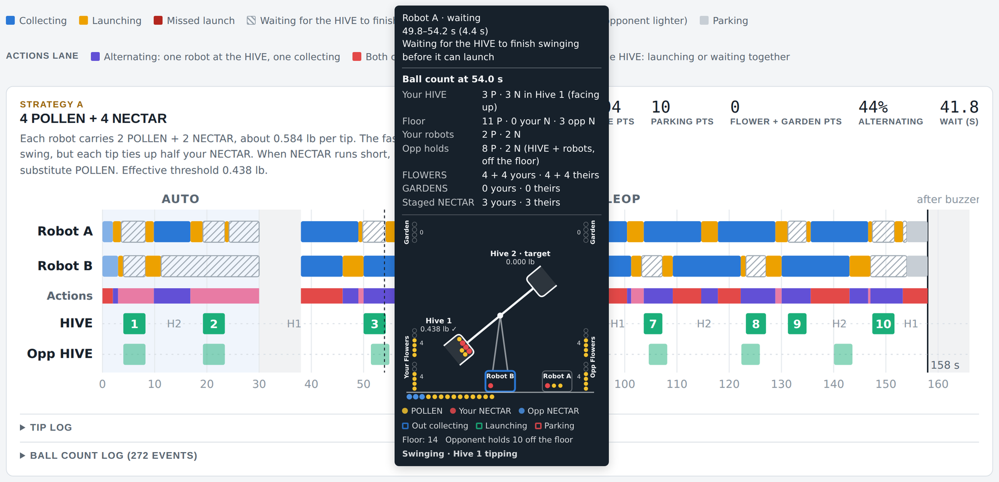

# FTC BIOBUZZ · HIVE planning and match analysis

**Lightning Robotics**



*A strategy timeline with the hover pop-up open at 54 s: Robot A waits beside the HIVE while Hive 1 tips, and Robot B is out collecting.*

Created by Michael Andrews ([mj@mikeandrews.me](mailto:mj@mikeandrews.me)), FTC Team 10262 and Claude Opus 5.5

A single-page planner for the 2026–27 FTC game **BIOBUZZ**. It does two jobs:

- **Planning**: simulates a full match from your robots' times and compares six ways of loading the HIVE, so you can pick the strategy that scores the most.
- **Match Analysis**: rebuilds a real match from events you log (optionally while watching the match video), measures your robots' actual times and error rates, and feeds them back into Planning.

Both tabs use the same game rules, the same Field Settings and the same scoring.

---

## Contents

1. [Getting started](#1-getting-started)
2. [Page layout](#2-page-layout)
3. [Field Settings](#3-field-settings)
4. [Planning tab](#4-planning-tab)
5. [Reading the strategy timelines](#5-reading-the-strategy-timelines)
6. [Match Analysis tab](#6-match-analysis-tab)
7. [Scoring used by the planner](#7-scoring-used-by-the-planner)
8. [How the simulation works](#8-how-the-simulation-works)
9. [Swing-time equations](#9-swing-time-equations)
10. [Files: planning and match JSON](#10-files-planning-and-match-json)
11. [Suggested workflows](#11-suggested-workflows)
12. [Assumptions and known limitations](#12-assumptions-and-known-limitations)
13. [Troubleshooting](#13-troubleshooting)
14. [Version history](#14-version-history)

---

## 1. Getting started

### Opening the planner

- **Shared link:** open the link in any modern browser (Chrome, Edge, Safari or Firefox) on a laptop, tablet or phone. Javascript is required.
- **HTML file:** double-click `biobuzz-hive-match-planner.html`. It runs entirely in your browser with no install and no server. An internet connection is only used to load the fonts; without one the page still works with your system fonts.

### Your settings are remembered

Everything you enter is saved automatically in your browser (local storage) and comes back the next time you open the page **in the same browser on the same device**. Settings do not travel between devices or browsers. To move or share settings, use the planning and match files (see [Section 10](#10-files-planning-and-match-json)).

### Info buttons

Blue **i** buttons next to section titles and some settings open a short explanation. Click the button again, click anywhere else or press **Esc** to close it.

### Restore example values

The **Restore example values** button (top right, Planning tab) resets every Planning input and Field Setting to the example robot. After a restore:

- Errors and recovery is **off**
- Show the opponent is **on**
- Use one collect time per robot is **on**
- The swing-time equations return to the fitted values

It does not touch anything on the Match Analysis tab.

---

## 2. Page layout

| Area | What it holds |
|---|---|
| **Header** | Title, the **i** button with an overview and credits, and Restore example values |
| **Field Settings** | Ball weights, FLOWER capacity, tip threshold and swing-time model. Shared by both tabs |
| **Planning tab** | Plan setup, Robot settings, Errors and recovery, Opponent alliance, Collect time per round, Strategy comparison, one timeline per strategy, and How the simulation works |
| **Match Analysis tab** | Match file, Teams, Match video, Log an event, Start and end of match, Event log, Match results and Match timelines |

The page adjusts to phone width, and follows your device's light or dark mode.

---

## 3. Field Settings

These describe the field and game pieces. They affect both tabs.

| Setting | Default | Meaning |
|---|---|---|
| **Ball weight (lb)**, P and N | 0.055 / 0.091 | Weight of one POLLEN and one NECTAR |
| **FLOWER scoring capacity (balls)** | 6 | The most balls a FLOWER holds. Each FLOWER starts with 4 POLLEN |
| **Tip threshold (lb)** | 0.438 | Load in the upward cell that makes the HIVE tip. Measured: no movement at 0.364–0.385 lb, tips at 0.438–0.44 lb |
| **Swing-time model** | Physics curve | Which equation turns the load in the cell into a swing time. Both equations can be edited in Analysis options (see [Section 9](#9-swing-time-equations)) |

---

## 4. Planning tab

### 4.1 Plan setup

- **Load planning file (.json):** replaces all Planning inputs and Field Settings with a saved file.
- **Save planning file (.json):** downloads every Planning input and Field Setting as a file named `biobuzz-plan-YYYY-MM-DD.json`. Save one per robot design or event.
- **Analysis options:** opens the options dialog described next.

### 4.2 Analysis options

| Option | Effect |
|---|---|
| **Show Errors and recovery** | Off: robots never miss or come up short, and early return is off. The Errors and recovery section is hidden |
| **Show the opponent** | On: the opponent is simulated, appears as the Opp HIVE lane and is included in the ball counts. Off: hides the Opponent alliance section and the opponent's lanes and counts |
| **Use one collect time per robot** | On: one collect time for Robot A and one for Robot B. Off: a separate collect time for each round |
| **Add NECTAR during AUTO** | On: your human player adds a NECTAR as soon as the HIVE tips in AUTO. Off: NECTAR earned by AUTO tips is held until TELEOP starts |
| **Where robots look for POLLEN first** | Prefer GARDEN or Prefer FLOWERS (applies to FLOWER-capable robots in TELEOP) |
| **Collect from the opponent's FLOWERS** | Lets FLOWER-capable robots take POLLEN from the other alliance's FLOWERS in TELEOP once the floor is empty. Never in AUTO |
| **Swing-time equations** | The constants of both swing equations. Each has an **i** button explaining how it was fitted |

Click **Done** to close the dialog.

### 4.3 Robot settings

There is one card for Robot A and one for Robot B. The opponent's robots use the same settings, scaled by the opponent cycle time.

| Setting | Meaning |
|---|---|
| **Launch time (s per ball or volley)** | Time for one launch: one ball, or a whole volley when launching all at once |
| **AUTO: drive to launch spot (s)** | Time from the start position to the launch spot with the 4 preloaded POLLEN |
| **Time to drive to PARK (s)** | How early the robot stops to drive to the LOADING ZONE before the end of AUTO (if parking after AUTO) or the end of the match |
| **Collects** | Both, POLLEN only or NECTAR only. A robot only collects balls it can launch |
| **Launches** | Both, on demand / Both, FIFO / POLLEN only / NECTAR only. *On demand:* launches whichever ball finishes the tip with the least extra weight, otherwise its heaviest. *FIFO:* in the order collected, NECTAR first |
| **Launch style** | *One at a time:* ball by ball. *All at once:* everything the robot holds in one volley taking one launch time, so weight above the threshold is dumped with the cell |
| **Holds (4 balls total)** | Up to N POLLEN or up to N NECTAR. Never more than 4 balls in total (G407). A POLLEN limit below 4 drops the extra preloads at the start, and a robot that can't use POLLEN drops all 4 |
| **Fill to capacity when idle** | While the HIVE swings, a robot with empty slots goes for more balls instead of waiting. A top-up trip takes the driving part plus a share of the search time for each empty slot. At the end of AUTO, a robot set to park uses spare time to collect POLLEN from your GARDEN or FLOWERS, then parks and keeps them for TELEOP |
| **Park after AUTO** | AUTO PARK: 5 points if the robot reaches the LOADING ZONE by 30 s. If it is carrying balls, it drives back to its launch spot at the start of TELEOP |
| **Park at end** | PARK: 5 points if the robot reaches the LOADING ZONE by the end of the match |
| **Can collect from FLOWERS** | Lets the robot take POLLEN out of the bottom of a FLOWER |
| **FLOWER collection time (s)** | Time to take 4 balls from a FLOWER (a share of it for fewer) |
| **Last 60 s** | *Keep tipping the HIVE*, *Fill your FLOWERS* or *Drop in your GARDEN* (see below) |

**Last 60 s choices**

- **Keep tipping the HIVE:** no change.
- **Fill your FLOWERS:** with 60 s or less left, the robot places balls in your FLOWERS instead of the HIVE. It puts NECTAR on top so your alliance owns the FLOWER, keeps the top spot of an unowned FLOWER free for NECTAR, and goes back to the HIVE once your FLOWERS are full.
- **Drop in your GARDEN:** every ball goes into your GARDEN for 1 point each. This scores far less than the other two choices, so use it only for a robot that can't launch.

### 4.4 Errors and recovery

Shown when Show Errors and recovery is on. Errors are spread evenly through the match, so the same settings always give the same result.

| Setting | Meaning |
|---|---|
| **Early return when the cell is short** | *Off:* always finish the round. *Endgame only:* turn back early only inside the endgame window. *Always:* turn back whenever holding enough balls to finish the tip |
| **Endgame window (s before buzzer)** | How long before the buzzer "Endgame only" applies |
| **Collect shortfall (%)** | Share of balls not found. 25% means 3 of 4 per round. Missing balls are POLLEN; preloads are never short |
| **Launch miss rate (%)** | Share of launches that miss the cell. 10% means every 10th ball. A miss takes a full launch time and the ball lands on the floor |
| **Driving part of each collect (s)** | Out-and-back driving time; the rest of the round is spent finding balls |

### 4.5 Opponent alliance

| Setting | Meaning |
|---|---|
| **Opponent strategy** | Which of the six strategies the opponent runs |
| **Opponent cycle time (% of yours)** | 100% = same speed as your robots; 120% = 20% slower |
| **Robot A / B can collect from FLOWERS** | FLOWER capability for each opponent robot |
| **Opponent last 60 s** | Same choices as your robots |

The opponent is simulated first, and its tips, dumps and POLLEN use are then applied to your simulation, so both alliances compete for the same loose balls.

### 4.6 Collect time per round (s)

One round is the time from leaving the launch spot to returning with 4 balls, ready to launch. With Use one collect time per robot on, you set one value per robot. Otherwise each round has its own value; use the **Apply** row to set every round at once. If a robot needs more rounds than listed, the last value repeats.

### 4.7 Strategy comparison

The six strategies, sorted by points (highest first). The letters A–F follow the current ranking and change when the order changes.

| Strategy | Load per tip |
|---|---|
| **7 POLLEN + 1 NECTAR** | Robot A 4 POLLEN, Robot B 3 POLLEN + 1 NECTAR (about 0.476 lb) |
| **6 POLLEN + 2 NECTAR** | Each robot 3 POLLEN + 1 NECTAR (about 0.512 lb) |
| **POLLEN only: 8 tips the HIVE** | Each robot 4 POLLEN; 8 POLLEN (0.44 lb) just clears the threshold, so the swing is slow |
| **POLLEN only: 8 falls short** | Each robot 4 POLLEN, but 8 does not tip; the 9th ball comes from the next load |
| **5 POLLEN + 3 NECTAR** | Robot A 3 POLLEN + 1 NECTAR, Robot B 2 POLLEN + 2 NECTAR (about 0.548 lb) |
| **4 POLLEN + 4 NECTAR** | Each robot 2 POLLEN + 2 NECTAR (about 0.584 lb); fastest swing, but ties up half your NECTAR |

Table columns:

| Column | Meaning |
|---|---|
| **Tips** | Total HIVE tips |
| **AUTO / TELEOP** | Tips completed in AUTO and in TELEOP |
| **Avg TELEOP gap** | Average time between TELEOP tips |
| **Alternating** | Share of active time when one robot is at the HIVE while the other collects |
| **Nobody at HIVE** | Time when both robots are away collecting |
| **Robot wait** | Total time robots spend waiting for the HIVE to finish swinging |
| **Left in cell** | Balls in the upward cell at the end (2 points each) |
| **Points** | HIVE + LEAVE + PARK + FLOWER + GARDEN points |
| **Ranking points** | POLLINATOR 1 (4+ tips), POLLINATOR 2 (7+ tips) and SWARM (16+ points from LEAVE + AUTO PARK + PARK) |

---

## 5. Reading the strategy timelines

Each strategy has a card with a description, a row of figures (Points, Tips, HIVE pts, Parking pts, FLOWER + GARDEN pts, Alternating, Wait) and a timeline.

### Timeline lanes

| Lane | Shows |
|---|---|
| **Robot A / Robot B** | What each robot is doing over time |
| **Actions** | Whether the robots are alternating, both at the HIVE, or both away collecting |
| **HIVE** | Your tips as numbered markers, with H1 or H2 for whichever cell faces up between tips |
| **Opp HIVE** | The opponent's tips (when Show the opponent is on) |

The shaded band from 0–30 s is AUTO; 30–38 s is the transition; 158 s is the buzzer.

### Robot bar colors

| Bar | Meaning |
|---|---|
| Light blue | AUTO: driving to the launch spot |
| Blue | Collecting (a trip that crosses the transition is split and pauses for 8 s) |
| Orange | Launching, or placing a ball in a FLOWER or GARDEN |
| Red | A missed launch |
| Hatched | Waiting (hover to see why) |
| Grey | Parking or parked |

**Every gap is shown as waiting**, and hovering explains the reason: waiting for the HIVE to finish swinging, no balls available to collect, nothing left to collect in AUTO, waiting to park after AUTO, or done for the match because another trip would not finish in time.

### Details panel and hover pop-up

Below every timeline is a **details panel**:

- **On a phone or tablet (including iOS Safari):** tap anywhere on the timeline. The panel opens below it, and a dashed line marks the chosen moment. Use the slider or the **−1 s / +1 s** buttons to step through the match, and **×** to close the panel. Swipe sideways on the timeline to scroll it as usual; only a tap picks a time.
- **With a mouse:** hover for a quick floating pop-up, or click to keep the details in the panel while you scroll.
- The panel remembers its time while you change settings, so you can watch how a change affects that moment.

The panel and the pop-up show:

- What each robot is doing at that moment (in the pop-up, the segment under the pointer), for example "collect round 3 · Brings back 4 POLLEN"
- **Ball count at that moment:** your HIVE, the floor, your robots, what the opponent holds, FLOWERS, GARDENS and staged NECTAR
- **A side-view picture of the field:**
  - The HIVE see-saw with both cells, their contents and weight (a ✓ when at or over the threshold); it swings during a tip
  - **Your FLOWERS** and **Opp FLOWERS** as stacks of 6 spots, with **Garden** stacks above them and counts beside each stack
  - Loose balls on the floor below the line (yellow POLLEN, red your NECTAR, blue opponent NECTAR)
  - Robot squares holding their balls. Border colors: **blue** collecting, **green** launching, **red** parking, grey otherwise (including paused for the transition)
  - Robot positions: launching robots, and robots waiting to launch, move to the outboard side of the target HIVE (the first to start takes the outermost spot); collecting, idle and ball-waiting robots sit in the middle

Below each card, the **Ball count log** lists every change in where the balls are, for both alliances.

---

## 6. Match Analysis tab

Use this tab to rebuild a real match from what you see.

### 6.1 Match file

- **Load match file (.json):** restores a logged match (events, teams, alliance color, checkboxes, video name and offset).
- **Export match file (.json):** saves the current match. Browsers can't reopen a video from a saved path, so after loading a match file, choose the video again under Match video.

### 6.2 Teams

Pick **Your alliance color** (the opponent gets the other) and optionally enter a team number or name for each robot. Names appear in the event log, tables and timelines.

### 6.3 Match video

1. Choose the **Video file** from your computer. It plays in the page and stays on your computer; it is not uploaded or saved with the page.
2. Pause the video at the start of AUTO and click **Set to current video time** (or type the **Video time when AUTO starts**).
3. While logging, **Use video time** fills in the match time for each event.
4. **Playback speed** offers 0.25× to 2×.

You can also watch the video elsewhere and type match times yourself. The player grows taller as the page gets wider.

### 6.4 Log an event

Pick the **Match time**, **Alliance**, **Robot** and **Action**, fill in the extra fields, then click **Add event**. Events can be logged in any order; the log sorts itself.

| Action | Extra fields | When to log it |
|---|---|---|
| **Leaves to collect** | – | The robot leaves its launch spot |
| **At launch spot with balls** | POLLEN picked up, NECTAR picked up | The robot is back and ready to launch. Choose 0 and 0 when it arrives with only its preload |
| **Launches** | Ball, How many, Missed the cell | One launch, or a volley of several balls of the same type |
| **HIVE tips** | – (no robot) | The alliance's HIVE starts to swing |
| **Places in a FLOWER** | FLOWER (own 1/2 or other alliance 1/2), Ball, How many | A ball is placed in a FLOWER |
| **Drops in a GARDEN** | GARDEN (own or other alliance), Ball, How many | A ball is dropped in a GARDEN |

The analysis warns about things that look wrong, such as a robot holding more than 4 balls, a tip below the threshold, or NECTAR placed in a FLOWER before the last 60 s.

### 6.5 Start and end of match

One row per robot, with checkboxes for **LEAVE in AUTO**, **PARK after AUTO**, **PARK at the end** and **Preloaded 4 POLLEN**.

### 6.6 Event log

Every logged event with **Edit** and **Delete** buttons.

- **Load example match:** fills the log with a generated match so you can explore the analysis. Clear it before logging your own.
- **Clear all events:** empties the log.
- **Copy or paste events:** copy the log as text to share it (for example in a chat), or paste text someone copied to load their match.

### 6.7 Match results

- **Alliance summary:** tips, AUTO / TELEOP tips, balls left in the cell, LEAVE + PARK, FLOWER + GARDEN, points and ranking points.
- **Robot table:** collect trips, average collect time (not counting the transition), collect shortfall, balls launched, launch miss rate, median launch time, time waiting for the HIVE and tips triggered.
- **Tip weights** recorded in the log compared with your threshold setting.
- **Use your robots' numbers in Planning:** copies your robots' measured launch time, collect times per round, collect shortfall, launch miss rate and AUTO drive time into the Planning tab and switches to it.

### 6.8 Match timelines

One timeline for **each alliance**: its two robots, Actions, its HIVE, a **Strategy** lane showing which Planning strategy each tip matched most closely (by its mix of POLLEN and NECTAR), and the other alliance's HIVE for comparison. Hovering works as on the Planning tab, from that alliance's point of view.

Below the timelines:

- **Tips and matching strategy:** each of your tips, the load that tipped it, its weight and the closest strategy.
- **Ball count log:** every change in where the balls are, rebuilt from your events.

---

## 7. Scoring used by the planner

| Item | Points | Notes |
|---|---|---|
| HIVE tip | 20 | Each tip of your HIVE |
| Balls left in the upward cell | 2 each | When everything comes to rest after the buzzer. Nothing for balls in the cell at the end of AUTO |
| LEAVE | 3 per robot | |
| AUTO PARK | 5 per robot | In the LOADING ZONE at the end of AUTO |
| PARK | 5 per robot | In the LOADING ZONE at the end of the match |
| FLOWER ownership | 2 per ball | The alliance with the top-most NECTAR of its color in a FLOWER scores every ball in it (TELEOP only) |
| Bottom NECTAR bonus | 5 per FLOWER | The alliance with the lowest NECTAR of its color in a FLOWER |
| GARDEN | 1 per ball | Every ball in a GARDEN at the end, for that GARDEN's color, including the 4 starting POLLEN |

**Ranking points:** POLLINATOR 1 at 4 tips, POLLINATOR 2 at 7 tips, SWARM at 16 or more points from LEAVE + AUTO PARK + PARK.

---

## 8. How the simulation works

### Match and field

- **Clock:** AUTO 0–30 s, an 8 s transition (robots stop, the HIVE keeps swinging), TELEOP 38–158 s.
- **Start:** each robot holds 4 POLLEN. Your upward cell (Hive 1) starts with 3 NECTAR (0.273 lb). Each GARDEN holds 4 POLLEN and each FLOWER 4 POLLEN.
- **Two cells:** Hive 1 is the target at the start. When it tips, Hive 2 faces up and becomes the target, and so on.

### Launching and tipping

- The HIVE tips the moment the cell reaches the threshold. Nobody can launch while it swings. Robots keep any extra balls and launch them into the new cell after the swing.
- When the HIVE tips, every ball in the cell lands on the floor once the swing finishes.
- A launch must finish before the robot leaves to PARK, or before 158 s. A swing still in progress at the buzzer counts.

### NECTAR

- Your human player has 5 NECTAR staged and brings one in after each tip. G427 releases all remaining staged NECTAR with 60 s left.
- NECTAR from a dumped cell goes back into the pool robots can collect.
- If a strategy calls for NECTAR and none is available, the robot collects POLLEN instead.
- NECTAR may only be placed in FLOWERS in the last 60 s (G410).

### Where robots collect

- **AUTO:** robots only use their preloads and balls from known places: their own GARDEN and, if allowed, their own FLOWERS. They never pick up loose balls or NECTAR from the floor, and never use the opponent's side (G402).
- **TELEOP:** both GARDENS, loose balls on the floor and FLOWERS, in the order set in Analysis options. The opponent's FLOWERS only once the floor is empty, if allowed.
- Only one robot can use a GARDEN or a FLOWER at a time.
- **FLOWERS** hold up to 6 balls. Balls come out only at the bottom (everything above drops one spot) and go in only at the top (falling to the lowest open spot). A NECTAR in the bottom spot can't be removed, so nothing more can be taken from that FLOWER, though balls can still be added while there is room.
- **GARDEN POLLEN** does not count as floor POLLEN, and every ball taken out of a GARDEN costs that alliance a GARDEN point.

### Collect rounds and errors

- Each round is: drive out, find balls one at a time at an even pace, drive back. Pickups are spread evenly across the trip and pause during the transition.
- **Early return:** when the cell is partly full but short of tipping, a collecting robot turns back as soon as it holds enough balls to finish the tip, unless its partner can already finish it. With early return on, a robot also cuts its last round short so it can launch before parking.
- **Shortfall and misses** are spread evenly, so results are repeatable.

### Ball accounting

The ball count tracks all 40 POLLEN and both alliances' 8 NECTAR at every moment, for both alliances.

---

## 9. Swing-time equations

The swing time (top to bottom, in seconds) is calculated from the load W (lb) in the cell when it tips. Both equations were fitted to three timed see-saw runs:

| Load (lb) | Result |
|---|---|
| 0.364, 0.383, 0.385 | Did not move |
| 0.438 | 3.773 s |
| 0.440 | 4.700 s |
| 0.546 | 2.796 s |

**Physics curve (default): t = 1.244 / √(W − 0.352)**

Treats the HIVE as a rigid see-saw turning under a constant net torque: the load pushes with a torque proportional to its weight and pivot friction resists like a constant load W0. That gives a constant angular acceleration, so the time to sweep the full angle is k / √(W − W0). Fitted by non-linear least squares: k = 1.244, W0 = 0.352 lb, R² ≈ 0.74. W0 is below the 0.438 lb threshold because it takes more force to start the swing (static friction) than to keep it going. This curve is the safer one for loads above the tested range.

**Straight line: t = 10.087 − 13.338 × W**

A purely empirical fit by ordinary least squares: R² ≈ 0.75, about 0.13 s faster per extra 0.01 lb. It would reach zero near 0.76 lb, so the planner never lets it go below 0.5 s; don't rely on it far above 0.546 lb.

**Improving the fit:** most of the remaining error comes from the two near-threshold runs (0.93 s apart for a 0.002 lb change). Time more runs, especially at 0.60–0.65 lb where the equations disagree most, refit, and enter the new constants in Analysis options.

---

## 10. Files: planning and match JSON

### Planning file (`biobuzz-plan-YYYY-MM-DD.json`)

```json
{
  "format": "biobuzz-plan",
  "version": 1,
  "saved": "2026-10-05T12:00:00.000Z",
  "settings": { "...": "every Planning input and Field Setting" }
}
```

`settings` holds all 63 settings: Field Settings, both robot cards, errors and recovery, opponent settings, Analysis options, swing-time constants and the collect time for every round. Loading a file replaces all of them; any setting missing from an older file falls back to its default.

### Match file

```json
{
  "format": "biobuzz-match",
  "version": 1,
  "exported": "2026-10-05T12:00:00.000Z",
  "video": { "path": "match-12.mp4", "offset": 3.5 },
  "teams": { "color": "red", "usA": "10262", "usB": "", "oppA": "", "oppB": "" },
  "flags": { "usA": { "leave": true, "apark": false, "park": true, "pre": true } },
  "events": [
    { "t": 4.0, "side": "us", "robot": "", "act": "tip" },
    { "t": 9.8, "side": "us", "robot": "A", "act": "collect" },
    { "t": 16.8, "side": "us", "robot": "A", "act": "ready", "p": 4, "n": 0 },
    { "t": 17.6, "side": "us", "robot": "A", "act": "launch", "ball": "P", "count": 1, "missed": 0 },
    { "t": 150, "side": "us", "robot": "B", "act": "fput", "ball": "N", "count": 1, "flower": "own0" },
    { "t": 152, "side": "opp", "robot": "A", "act": "gput", "ball": "P", "count": 1, "garden": "own" }
  ]
}
```

- `side` is `us` or `opp`; `robot` is `A`, `B`, or empty for a tip.
- `act` is one of `collect`, `ready`, `launch`, `tip`, `fput` (FLOWER) or `gput` (GARDEN).
- `flower` is `own0`, `own1`, `opp0` or `opp1`; `garden` is `own` or `opp`.

**Note:** a match file does not include Field Settings. Match Analysis uses the ball weights, threshold, FLOWER capacity and swing equations set on the viewer's page, so share a planning file too if teammates need identical results.

---

## 11. Suggested workflows

**Choosing a strategy before an event**

1. Click **Restore example values**, then enter your robots' times in Robot settings and Collect time per round.
2. Turn on **Show Errors and recovery** and enter realistic shortfall and miss rates.
3. Set the opponent you expect under Opponent alliance.
4. Read the **Strategy comparison** and hover the top timelines to see where time is lost (long waits, nobody at the HIVE).
5. Try capability changes (FLOWER collection, Fill to capacity, Last 60 s) and compare.
6. **Save planning file** to keep the result.

**Reviewing a match**

1. On Match Analysis, set the teams and alliance color and load the match video.
2. Set the video time when AUTO starts.
3. Step through the video and log each robot's trips, launches and tips, using **Use video time**.
4. Tick the LEAVE / PARK / preload boxes.
5. Check **Match results** and any warnings, then compare both alliances' timelines.
6. Click **Use your robots' numbers in Planning** to rerun the plan with measured times.
7. **Export match file** to keep the log.

---

## 12. Assumptions and known limitations

- **FLOWER points** count every ball in an owned FLOWER, including the starting POLLEN. The game manual only scores balls between the top and middle rings; if the bottom spots sit below the middle ring, the planner overstates FLOWER points. Check on a real FLOWER.
- **The opponent is simulated separately** and then applied to your match (one-way). Occasionally a few POLLEN don't add up (up to about 5 in testing); the ball count log notes any shortfall.
- **One shared floor:** dumped balls from both HIVEs go into a single floor pool in TELEOP.
- **Collect times** are averages: the planner doesn't model field position or driving paths.
- **Swing times** come from three timed runs, so treat them as estimates until more runs are timed.
- **Rules:** based on the BIOBUZZ Competition Manual (Section 10 and Team Update 02). Check the latest Team Updates for changes to point values or rules.

---

## 13. Troubleshooting

| Problem | Fix |
|---|---|
| My settings are gone | Settings are stored per browser and device. Load a planning file, or use the browser you used before. Private windows don't keep settings |
| The video doesn't play | Choose the video file again under Match video (it is never saved). Use a format your browser plays, such as MP4 (H.264) or WebM |
| "isn't a planning file" when loading | Only files saved with Save planning file can be loaded there; match files go under Match file |
| Analysis numbers differ from a teammate's | Compare Field Settings: the match file doesn't carry them |
| A robot waits in AUTO with nothing to do | In AUTO robots can't pick up loose floor balls. Turn on Can collect from FLOWERS or adjust the plan |
| The hover pop-up is awkward on a phone | Tap the timeline instead and use the details panel below it |
| Fonts look different offline | The page falls back to system fonts without an internet connection; everything still works |

---

## 14. Version history

**Version 1.0**

- Planning and Match Analysis tabs with a shared simulation and scoring model
- Six strategies, error and recovery modelling, opponent simulation
- FLOWER and GARDEN scoring, last-60-second plans, editable swing equations
- Match video logging, both-alliance timelines, planning and match files

**Changes after 1.0**

- Robots waiting to launch move beside the target HIVE; robots waiting for balls stay in the middle
- Robots show as paused (grey) during the AUTO-to-TELEOP transition
- In AUTO, robots collect only from their preloads, own GARDEN and (if allowed) own FLOWERS, never loose balls on the floor
- Ball count log no longer names a source a ball didn't actually come from
- Details panel below every timeline: tap (or click) to pick a moment, then step with a slider or ±1 s buttons; works well on iOS Safari and other touch screens
